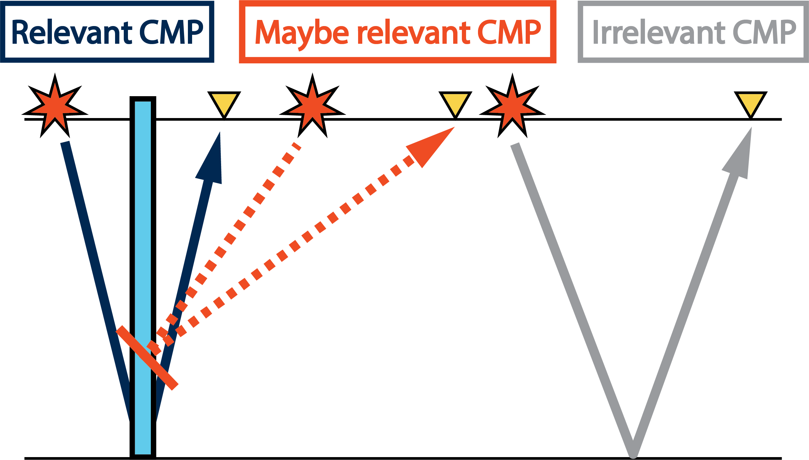
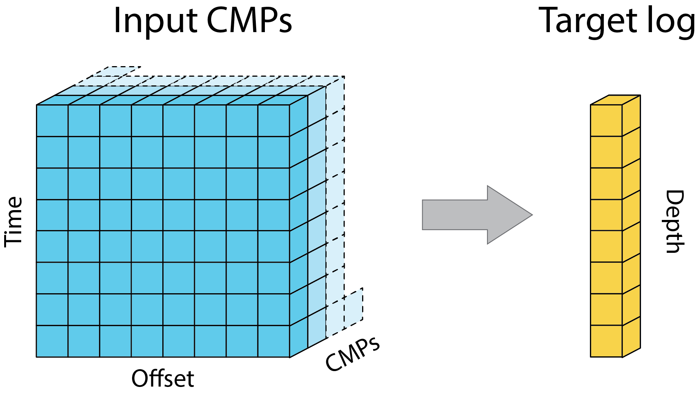

# deeplogs
Velocity model building by deep learning. Multi-CMP gathers are mapped into velocity logs.

Run:

    data/velocity_logs_from_seismic.ipynb

Selected Common-midpoint gathers of seismic data are used to build a velocity log in the midpoint location. Iteratively, the entire target velocity model is inverted as an assembly of depth profiles.

This repository reproduces results of the paper: 

Kazei, V., Ovcharenko, O., Zhang, X., Peter, D. & Alkhalifah, T. 
**"Mapping seismic data cubes to vertical velocity profiles by deep learning: New full-waveform inversion paradigm?"**,
Geophysics, submitted (2019)