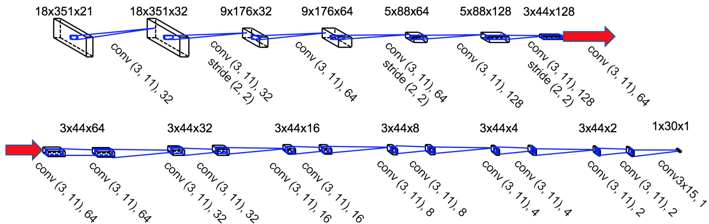
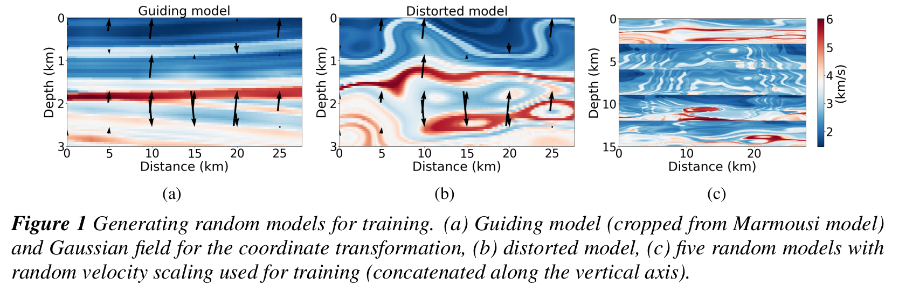
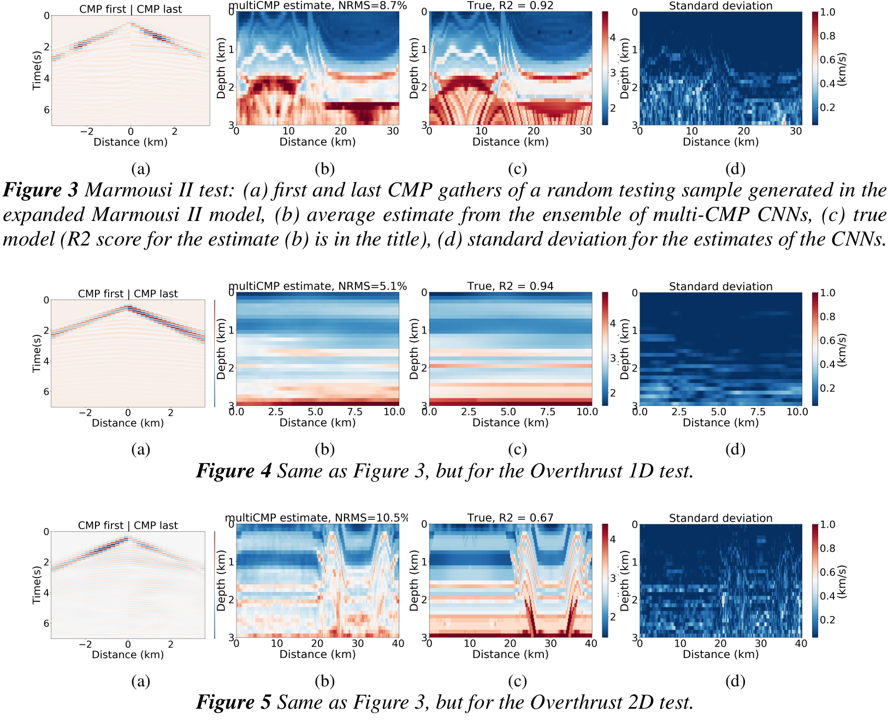

# deeplogs
Velocity model building by deep learning. Multi-CMP gathers are mapped into velocity logs.

This repository reproduces the results of the papers: 

Kazei, V., Ovcharenko, O., Plotnitskii, P., Zhang, X., Peter, D. & Alkhalifah, T.
**"Mapping full seismic waveforms to vertical velocity profiles by deep learning"**,
Geophysics, in moderate revision (2020)
[https://repository.kaust.edu.sa/handle/10754/656082]

Kazei, V., Ovcharenko, O., Plotnitskii, P., Zhang, X., Peter, D. & Alkhalifah, T.
**"Deep learning tomography by mapping full seismic waveforms to vertical velocity profiles"**,
EAGE Annual meeting, 2020

Run:

    data/velocity_logs_from_seismic.ipynb

Common-midpoint gathers are used to build a velocity log at the central midpoint location. 
This allows us to utilize relevant traces for inversion and exploit the regualrity of sampling in typical active seismic acquisition.

With deep learning and regularly sampled data inversion can be set up as a search for mapping from data cubes to 1D vertical velocity profiles. Which is a lot easier to learn compared to mapping to the whole velocity models (2D or 3D).

We generate a set of pseudo-random models for training by cropping and skewing:

Velocity model is then retrieved as an assembly of depth profiles. Deep learning models are naturally stochastic, so we train as set of five to provide initial uncertainty estimates:

